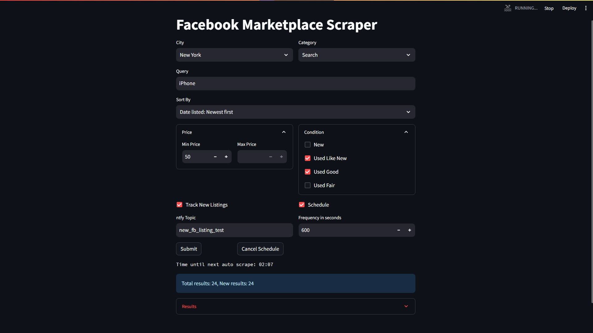

# facebook-marketplace-scraper

<h3 align="center">
  An open-source Python program to scrape Facebook Marketplace using Playwright, BeautifulSoup, and FastAPI with a Streamlit GUI.
<h3 align="center">

```diff
Use the software provided at your own risk. I cannot be held responsible for any potential consequences, including potential bans from Meta.
```


Overview
========

This open-source program uses Python to scrape data from Facebook Marketplace.
A Streamlit web GUI allows for various search parameters to be submitted to the backend API.
The program uses Playwright to navigate the Facebook Marketplace website and BeautifulSoup to extract relevant data.
It then sends and displays the results in the Streamlit web GUI.

<p align="center">
  
</p>

GUI Features:
--------

User friendly Streamlit interface for api communication.
- Enter search parameters and press the submission button to start scraping. 
- Set scheduled auto scrape, see time until auto scrape, and cancel schedule.
- Display Results Per Listing: Title, image, price, location, item URL, and New.

Search parameters:
- City: Select from a list of supported cities.
- Category: Select one of the marketplace product categories, or generic search.
- Query: Enter key words to search for. Available when the "Search" category is selected.
- Sort By: Select how to sort the results.
- Price Range: Set the min and max price.
- Condition: Checkboxes for the item condition.

Search settings:
- Track new Listings: Checkbox for API to track new results using a database.
- ntfy Topic: Send push notifications to this nfty topic.
- Schedule: Checkbox to set auto scrape every set time.
- Frequency: The time (in seconds) before each auto scrape.

API:
--------

- IP information retrieval.
- Root: Displays a welcome message.
- Data scraping: Parameters include city, category, and query

### Installation

Todo

#### Customization

This program can be customized to your personal/organizational needs.
- Streamlit GUI
- Playwright
- BeautifulSoup
- SQLAlchemy
  
#### Language:

- [Python](https://www.python.org/)

#### Requirements:

See requirements.txt
- Python 3.x
- Playwright
- Streamlit
- BeautifulSoup
- SQLAlchemy


Database Schema:
========

The database is primarily used by the API for tracking new listings.
- Tables: SearchCriteria, Listing
- Names: search_criteria, results

### SearchCriteria:

- Table Name: search_criteria
- Description: Stores criteria used for searching.

- Columns:
  - id (Integer, Primary Key)
  - city (String)
  - category (String)
  - query (String)
  - timestamp (DateTime): The Datetime when created (default is current time).

- Relationships:
    results (One-to-Many): Relationship to Listing table. A single search criteria can be associated with multiple listings.

### Listing:

- Table Name: results
- Description: Stores individual search results associated with specific search criteria.

- Columns:
  - id (Integer, Primary Key)
  - search_id (Integer, Foreign Key): Foreign key referencing search_criteria.id.
  - order (Integer): Order of the listings as found on facebook from search.
  - url (Text): URL of the listing.
  - title (String)
  - price (String)
  - location (String)
  - image (Text): URL to the image of the listing.
  - is_new (Boolean, Default=True): Track whether the listing is new.
  - timestamp (DateTime): The timestamp when the listing was added (default is current time).

- Constraints:
  - Unique constraint on search_id and url to ensure that the same URL does not appear more than once for a given search criteria.

- Relationships:
  - search_criteria (Many-to-One): Relationship to SearchCriteria table. Each listing is associated with one search criteria.

#### Notes:

  - The UniqueConstraint on search_id and url in the results table prevents duplicate URL entries in a search criteria.
  - Ensure that search_id in the results table references an existing id in the search_criteria table.


Implementation
========

Logger for info and debugging in all files.

### app.py

Hosts the api:
- Api created with FastAPI.
- Application server run using Uvicorn.
- Browser automation and data scraping using Playwright.
- HTML content parsing with BeautifulSoup.
- Data returned in JSON format.

### database.py

Stores marketplace data:
- Uses SQLAlchemy to manage a SQLite database.
- Insert lists of results into database under search_id.

### gui.py

Streamlit interface:
- Makes use of api_utils.py and notify.py

### api_utils.py

Contains helper functions for establishing app.py connection.
- API URLs defined.
- Function to return formatted parameters.
- Function to return results from API based on params.

### notify.py

Send a post request to ntfy server:
- Specify: ntfy_topic, message, title, priority, link, image